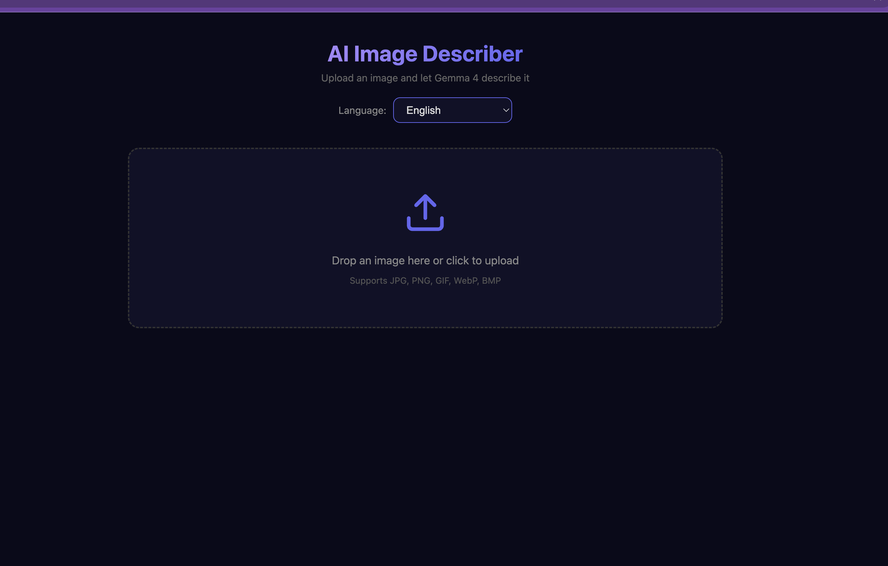
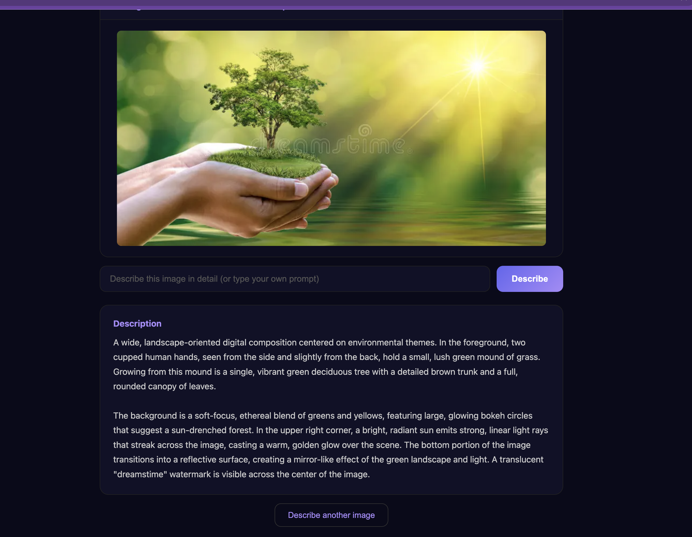
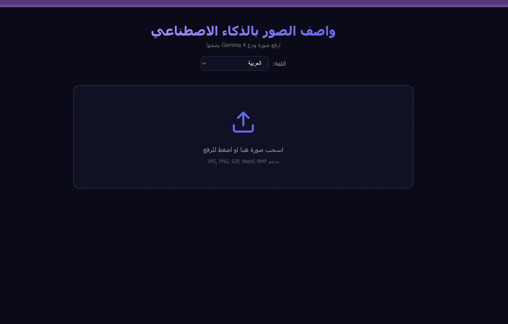

# AI Image Describer

A web-based AI image description tool powered by **Gemma 4 (31B)** running locally via Ollama. Upload any image and get a detailed AI-generated description.





## Multi-Language Support (35 languages)

The UI and AI responses fully adapt to the selected language, including RTL support for Arabic, Persian, Hebrew, and Urdu.



## Features

- 35 languages supported with full UI translation
- RTL layout for Arabic, Persian, Hebrew, and Urdu
- Drag & drop or click to upload images
- Custom prompts — ask specific questions about the image
- Powered by Gemma 4 (31B) vision model via Ollama
- Runs 100% locally — no API keys, no cloud, no cost
- Zero dependencies — pure Python, no pip install needed
- CLI tool included for quick terminal usage

## Requirements

- Python 3
- [Ollama](https://ollama.com) with the `gemma4:31b-cloud` model
- FFmpeg (optional, for video frame extraction in CLI mode)

## Setup

1. Install Ollama and pull the model:
   ```bash
   ollama pull gemma4:31b-cloud
   ```

2. Make sure Ollama is running:
   ```bash
   ollama serve
   ```

## Usage

### Web App

```bash
python3 app.py
```
Open **http://localhost:8899** in your browser.

### CLI

```bash
# Describe an image
python3 describe.py photo.jpg

# With a custom prompt
python3 describe.py photo.jpg "What text is in this image?"

# Describe a video (extracts frames with ffmpeg)
python3 describe.py video.mp4
```
